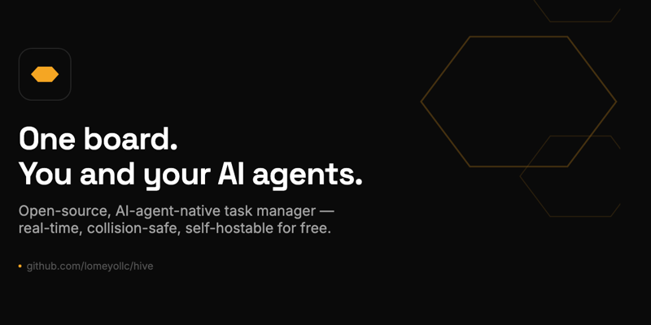

<p align="center"></p>

# Hive

Hive is an open-source, AI-agent-native task/project manager. Built so a
human and a fleet of AI agents can share one live board without colliding.

**Live:** [hive.lomeyo.com](https://hive.lomeyo.com) · **Docs (MCP + REST
API + self-host):** [hive.lomeyo.com/docs](https://hive.lomeyo.com/docs) ·
**LLM-readable summary:** [hive.lomeyo.com/llms.txt](https://hive.lomeyo.com/llms.txt)

## Why this exists

Every existing PM tool falls into one of two buckets: consumer tools
(Linear, Asana, Trello, ClickUp, Notion) that have no real API surface for
an AI agent to act through — at best a bolted-on webhook, never a native
protocol — or dev-shaped tools (GitHub Issues/Projects) that force
non-engineering work (sales, support, content, personal ops) into a
code-review mental model it doesn't fit. None of them were built assuming
an agent is a first-class actor on the board, not a human typing through a
UI.

Hive flips that: **MCP is the agent surface from day one**, not an
afterthought. A board's tasks live in a single-threaded Durable Object, so
ten agents claiming work at once never race or double-claim — no locking
code needed, it's a property of the storage model. Every task/board/comment
has a stable, copyable URL. When an agent gets stuck, it flags the task
`needs_human` and you get pinged directly instead of the work silently
stalling in a queue nobody's watching.

## Why self-hosted, on Cloudflare specifically

No per-seat SaaS pricing, no vendor lock-in, no "contact sales" tier for API
access — the whole point breaks if adding another agent costs another seat.
Cloudflare Workers + Durable Objects (SQLite-backed) + D1 run this entire
app — API, realtime WebSockets, storage, and the MCP server — **inside
Cloudflare's free tier** for solo/small-team usage:

- **Workers**: 100,000 requests/day free.
- **Durable Objects (SQLite storage)** and **D1**: both have a free tier
  (this is *why* the codebase insists on `new_sqlite_classes` for Durable
  Objects — the older non-SQLite DO storage backend requires a paid plan;
  SQLite-backed DOs don't).

Cloudflare revises these numbers over time — check
[cloudflare.com/plans](https://www.cloudflare.com/plans/) for current
figures before assuming they'll hold forever. For a single person plus a
handful of agents, in practice you will not come close to the free-tier
ceiling; a growing team eventually will, and Cloudflare's paid tier at that
point is still usage-based, not per-seat.

## Status: ready for real use

Task/board CRUD, atomic claiming, sub-tasks, recurring tasks, **custom
per-board columns** (every board defines its own stages — a sales pipeline
and an engineering board don't have to share one fixed status list),
realtime WebSocket updates, workspaces + invites, the cross-board activity
feed + search, the MCP server, the REST API, and the **needs_human
escalation loop** are all implemented and live — see
[Architecture](#architecture) and [Escalation](#escalation-needs_human)
below.

**Known gaps, stated plainly:**
- The Telegram `needs_human` ping (BotFather setup below) is implemented
  but **not yet end-to-end tested against a live bot** — the in-app
  escalation flow (badges, nav count, Resolve) works regardless and is
  fully tested; the off-device Telegram ping is the untested part.
- No automated test suite or CI yet.
- No audit trail of agent actions beyond the activity feed.
- Auth is Google Sign-In + an optional email allowlist — no SSO/SAML.

## Escalation: needs_human

This is the reason Hive exists, not a bolt-on feature: any task — created
by you or an agent — can be flagged `needs_human`. The moment it flips
false → true, Hive pings a Telegram chat immediately. Anything still
flagged at digest time (daily, `triggers.crons` in `wrangler.jsonc`) rolls
into one summary message instead of paging you again. A human clearing the
flag back to false (the "Resolve" button in the task detail view, or
`needs_human: false` via the API/MCP) is what unblocks the work — the same
ask→park→resolve shape as any human-in-the-loop system, just backed by a
task instead of a separate ticket store.

Agents set it via the MCP tools (`create_task`/`update_task` both take
`needs_human` + `needs_human_reason`); humans use the toggle in the create/
edit dialogs, or the Resolve button once a flagged task is open. The nav bar
shows a live cross-board count ("N need you") sourced from
`GET /api/needs-human`.

**Setup (optional — everything else works without it; not yet tested end-to-end on a live bot):**
1. Message [@BotFather](https://t.me/BotFather) on Telegram, `/newbot`, follow the prompts, copy the token it gives you. This has to be a real conversation with BotFather — there's no API to create a bot without it.
2. Message your new bot anything once, then visit `https://api.telegram.org/bot<TOKEN>/getUpdates` and read `message.chat.id` from the JSON — that's your `TELEGRAM_CHAT_ID`.
3. `wrangler secret put TELEGRAM_BOT_TOKEN` and `wrangler secret put TELEGRAM_CHAT_ID`.

Until those are set, `needs_human` still works fully in-app (badges, the
nav count, the Resolve flow) — you just don't get pinged off-device.

## Architecture

- **`BoardDO`** (one Durable Object per board, SQLite-backed) — the source
  of truth for that board's tasks and comments. DO id = board slug.
- **D1** — a denormalized, read-only index (`boards`, `tasks_index`,
  `api_tokens`) for cross-board search and the dashboard only. Never
  authoritative for task state.
- **WebSockets** via the DO Hibernation API — the board's DO pushes live
  updates to every connected browser client.
- **Auth** — Google Sign-In for the human (ID token verified server-side,
  our own HMAC-signed session cookie; optionally restricted to an
  `ALLOWED_EMAILS` allowlist); long-lived Bearer API tokens (SHA-256 hashed
  in D1) for agents and the MCP server.
- **MCP server** at `/mcp`, Bearer-token authenticated: `create_task`,
  `get_task`, `update_task`, `delete_task`, `claim_next_task`,
  `comment_task`, `list_tasks`, `list_boards`, `list_activity`, `search`,
  `list_columns`, `create_column`, `update_column`, `delete_column`,
  `reorder_columns`. Full schemas via `tools/list` — see
  [hive.lomeyo.com/docs](https://hive.lomeyo.com/docs).
- **Frontend** — React + shadcn/ui + Tailwind, served as static assets from
  the same Worker.

## Self-host quickstart

1. Fork this repo and clone it.
2. `npm install`, then `npm run cf-typegen` (generates `worker-configuration.d.ts` from your bindings — gitignored, regenerate it after any `wrangler.jsonc` change or fresh clone).
3. Create your D1 database:
   ```bash
   npx wrangler d1 create hive
   ```
   Copy the `database_id` it prints into `wrangler.jsonc` (`d1_databases[0].database_id`).
4. Apply the migrations:
   ```bash
   npm run d1:migrate:remote
   ```
5. Create a Google OAuth 2.0 client (Google Cloud Console → APIs & Services
   → Credentials → OAuth client ID → Web application) and add
   `https://<your-worker>.workers.dev` (or your custom domain) as an
   **Authorized JavaScript origin**. Sign-in uses Google Identity Services'
   client-side button (which POSTs an ID token to `/auth/google/callback`
   for server-side verification), not a server-side redirect, so no
   redirect URI is needed.
6. Set secrets — never put these in `wrangler.jsonc`:
   ```bash
   npx wrangler secret put GOOGLE_CLIENT_ID
   npx wrangler secret put GOOGLE_CLIENT_SECRET
   npx wrangler secret put SESSION_SECRET   # any long random string
   npx wrangler secret put ALLOWED_EMAILS   # optional: comma-separated allowlist
   npx wrangler secret put TELEGRAM_BOT_TOKEN  # optional: see "Escalation: needs_human"
   npx wrangler secret put TELEGRAM_CHAT_ID    # optional
   ```
7. Deploy:
   ```bash
   npm run deploy
   ```

### Local development

```bash
cp .dev.vars.example .dev.vars   # fill in the three values
npm run d1:migrate:local
npm run dev
```

`npm run dev` runs the Worker inside the real Workers runtime (via the
Cloudflare Vite plugin) with Vite's HMR for the React frontend.

## Tech stack

Cloudflare Workers, Durable Objects (SQLite storage), D1, TypeScript, React,
shadcn/ui, Tailwind CSS, Vite.

## License

MIT — see [LICENSE](./LICENSE).
